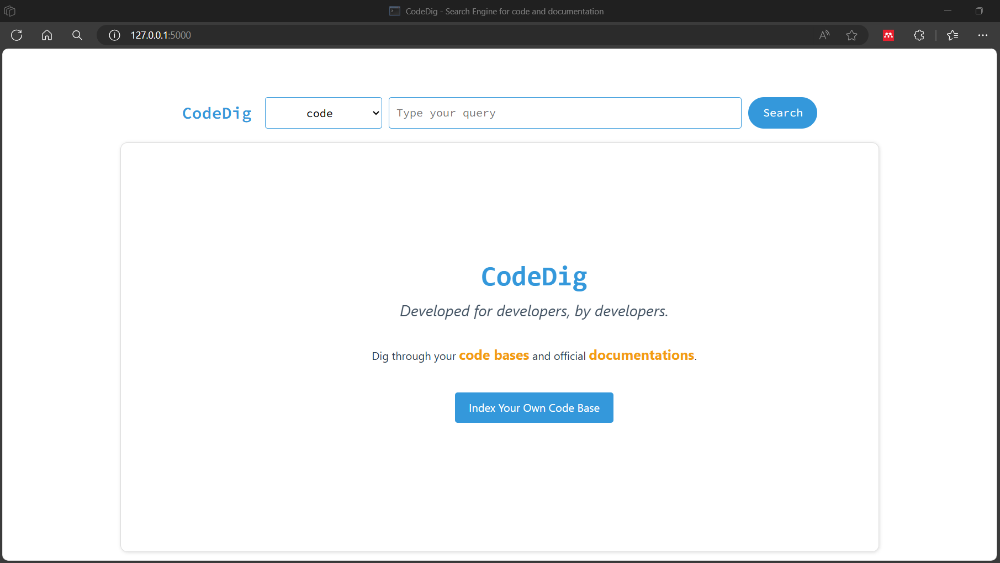

# codedig
 A semantic code search engine <br>
 This is <strong>WebIR course Project</strong>

### Run
```bash
$ flask --app codedig --debug run
```

</img>

Click on  Index Your Own code and provide folder path to your code base. 

Indexing the code requires [ChatGLM API KEY](https://open.bigmodel.cn/), if you are going to use another API, eg OpenAI API, modify `explain_code_snippet()` function inside `index.py` file

### Documentation
For documentaion, first run `scraper.py` to scrape documentation data from official websites, then index it with `index_docs()` function in  `index.py` file. 

### Future
Maybe VS code extension?